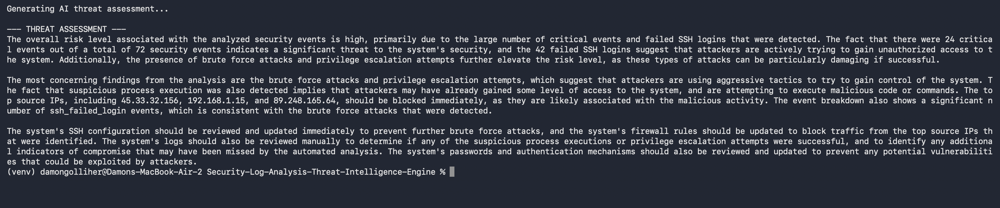
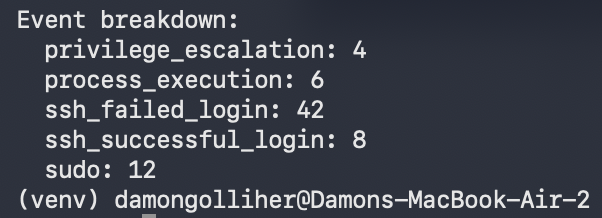

# AI-Driven Security Log Analysis and Threat Intelligence Engine

Python | Groq LLaMA API | JSON | HTML Reporting

---

## Background

What drew me to this project was the rise in AI and how it is changing the way
security work actually gets done. I wanted to test out how different AI models
handle security threat assessments and whether the output would be something
useful or just another formatted list that tells you nothing new.

So I built the detection engine first. The behavioral analysis logic catches
brute force patterns, privilege escalation attempts, and suspicious process
execution from raw log data. Then I wired it into the Groq API to see what
the model did with structured findings. The output ended up being more useful
than I expected. It reads like a person wrote it rather than a generated
template, which was the whole point.

This is not trying to replace an analyst. It is trying to handle the first
pass so the analyst can focus on what actually matters.

---

## What It Does

Generates realistic security event logs across five categories, runs behavioral
analysis to detect attack patterns, sends structured findings to an AI model,
and produces an HTML threat intelligence report with severity scoring, IP
classification, and a plain language assessment.

---

## Screenshots

### AI Generated Threat Assessment


### AEvent Breakdown 


---

## Results

| Metric | Value |
|---|---|
| Total events analyzed | 72 |
| Critical severity events | 24 |
| Failed login attempts | 42 |
| Brute force detected | Yes |
| Privilege escalation detected | Yes |
| Suspicious process execution | Yes |
| Risk level | High |

---

## How to Run

```bash
git clone https://github.com/Damonlee005/Security-Log-Analysis-Threat-Intelligence-Engine
cd Security-Log-Analysis-Threat-Intelligence-Engine
python3 -m venv venv && source venv/bin/activate
pip install -r requirements.txt
export GROQ_API_KEY="your-key-here"
python scripts/log_generator.py
python scripts/analyzer.py
python scripts/report_generator.py
open reports/threat_report.html
```

---

## Dataset

Security events are synthetically generated to simulate realistic Linux server
activity across five labeled categories. Using synthetic data is standard
practice for security tool development. You need controlled test cases to
validate that detection logic works before pointing it at real systems.

---

## Project Structure
Security-Log-Analysis-Threat-Intelligence-Engine/
├── logs/
├── scripts/
│   ├── log_generator.py
│   ├── analyzer.py
│   └── report_generator.py
├── reports/
│   └── threat_report.html
├── screenshots/
└── requirements.txt

---

## Future Work

I would like to keep building on this and apply it to real world datasets as they
become available. The part that interests me most is staying current with how AI
driven assessments are evolving, specifically how AI is changing security workflows
at every level of an organization, from entry level IT staff who are the first ones
to see something wrong, all the way up to the people making decisions about
organizational risk. That gap between what the tool catches and what a human
needs to act on it is where I think the most interesting work is.
